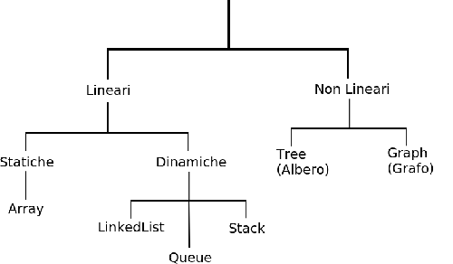

<!-- https://it.wikipedia.org/wiki/Programmazione_orientata_agli_oggetti -->

# Programmazione Orientata Agli Oggetti
(Object Oriented Programming, OOP) è un **paradigma di programmazione** che permette di definire oggetti software indipendenti in grado di interagire gli uni con gli altri attraverso lo scambio di messaggi. Un oggetto comprende sia dati (attributi) che funzioni (metodi). 

Esempi di paradigmi di programmazione alternativi sono la programmazione procedurale (come nel linguaggio C), o funzionale (come nel linguaggio Haskell).

## Cenni Storici 
Il primo linguaggio di programmazione orientato agli oggetti fu il Simula (1967), seguito negli anni settanta da Smalltalk. L'Orietamento agli Oggetti diventò il paradigma di programmazione dominante negli anni novanta. 

## Classi e Oggetti

Una classe è il modello **(blueprint)** con qui verranno creati  **o istanziati** degli oggetti. Un oggetto è un'istanza di una data classe, per esempio:

```java 
Gatto malachia = new Gatto();
Gatto silvestro = new Gatto();
```

`Gatto` è una classe, `malachia` e `silvestro` sono due istanze diverse (due oggetti) della stessa classe.


## Attributi e Metodi

Un **attributo** di un oggetto è un dato che lo caratterizza, un **metodo** invece è una funzione legata all'oggetto. La classe `Gatto`, per esempio, può prevedere gli attributi: `età`, `razza`, `sesso`, e un metodo `calcolaAreaTerritorio()` che usa i suddetti dati per compiere il calcolo e ritornare il valore.

Nelle classi più complesse, gli attributi stessi possono essere a loro volta degli oggetti.


## I Meccanismi dell'OOP

Un linguaggio è detto orientato agli oggetti quando permette di implementare, usando la sintassi nativa del linguagio, i tre meccanismi di:

## 1 Incapsulamento 
La netta separazione fra **interfaccia** e **implementazione**. Gli oggetti sono come delle scatole nere, dall'esterno non si ha accesso ai dettagli implementativi. Questo aggiunge flessibilità e modularità: meno gli oggetti si conoscono fra loro, più è facile scambiarne le implementazioni.

*es: voglio **debuggare** un programma che dovrebbe ottenere dei dati remoti dal web, ma non voglio sprecare banda inutilmente durante i test. Allora, posso implementare la stessa interfaccia "ClientWeb" in due modi diversi. Una sarà l'implementazione che si connette effettivamente al servizio esterno, e la useranno gli utenti del prodotto finale. Un'altra sarà usata a scopo di testing, e pescherà i dati da un file in locale, o li genererà in modo casuale. Per il resto del programma, i "ClientWeb" sono una scatola nera!*


## 2 Ereditarietà
Permette di estendere le funzionalità delle classi definendo delle sottoclassi.

*es: se ho già la classe `Felino` che ha il metodo `salta()`, non voglio dover ri-scrivere il codice (duplicandolo) quando definisco la classe `Gatto`. Posso allora estendere la classe `Felino`, ereditando il codice già pronto.*

## 3 Polimorfismo
Due oggetti di tipo diverso possono avere un'interfaccia in comune. Chi li chiama dall'esterno può non vedere la differenza, ma gli oggetti si comporteranno comunque in modo leggermente diverso. 

*es: ho due tipi di prodotti diversi nell'inventario, che richiedono due formule diverse per il calcolo del loro prezzo. Posso creare due classi che implementano la stessa interfaccia "Acquistabile", con un metodo calcolaPrezzo(). La Cassa che farà la sommatoria dei prezzi per arrivare al totale, non sa che ciascun tipo di prodotto calcola internamente in modo diverso il proprio prezzo.* 


## Gli ogetti devono avere

### Alta Coesione: 
una classe ha un compito ben preciso, fa solo un certo tipo di cose correlate, e non troppe! "Separation of concerns", non vogliamo che la macchinetta del caffè abbia anche la funzionalità "contatta presidente degli Stati Uniti".


### Basso Accoppiamento: 
gli oggetti appunto si conoscono il meno possibile, questo per garantire sostituibilità di un implementazione con un'altra, e quindi buona modularità e manutenibilità.


<br/>
<br/>

**(Questo è vero in generale, ma c'è un margine per i compromessi).**

# Java 

<!-- https://it.wikipedia.org/wiki/Java_(linguaggio_di_programmazione) -->

Java è un linguaggio di programmazione ad **alto livello**, **orientato agli oggetti** e a **tipizzazione statica**, che si appoggia sull'omonima piattaforma software di esecuzione, specificamente progettato per essere il più possibile indipendente dalla piattaforma hardware di esecuzione (tramite compilazione in **bytecode** prima e interpretazione poi da parte di una JVM).

Decifriamo un attimo i termini "gergali" in grassetto. 

* Alto livello: vuol dire semplicemente che è più comodo da usare che un linguaggio di più basso livello (per esempio assembly).
* Orientato agli Oggetti: vedi [I Meccanismi dell'OOP](#i-meccanismi-delloop)


* Tipizzazione Statica: vuol dire che una volta dicharata la variabile `x` di un certo tipo (per esempio `int`), è proibito riassegnarla con un valore di tipo diverso (per esempio `float`, `double` ecc...).

```java
int x = 1; // x è un int per sempre!
x = 2.1; // errore! errore! il compilatore si lamenta!
```

* Bytecode vedi [Java Virtual Machine (JVM)](#java-virtual-machine-jvm)


## Java Virtual Machine (JVM) 

Il codice in linguaggio Java viene compilato in così detto 'bytecode', che non è altro che un tipo di codice macchina (zeri e uni), ma non per una macchina fisica, bensì per la Macchina Virtuale Java (JVM). La JVM, che dev'essere installata sul computer che esegue il bytecode, converte quest'ultimo in codice macchina "vero e proprio" (nativo), per esempio in codice macchina x86, se si sta eseguendo il programma su un tipico PC. 

Il vantaggio di questo schema, è che il programmatore può scrivere il codice una volta, compilarlo in bytecode, e distribuirlo. Gli utenti possono trovarsi su svariate piattaforme (Windows, Mac, Linux ...) e il programma funzionerà comunque, a patto che la JVM sia correttamente installata su tutti i dispositivi. 

Oggigiorno, esistono addirittura svariati altri linguaggi oltre a Java che possono eseguire sulla JVM. Questo è reso possibile proprio grazie al fatto che la JVM ragiona in termini di bytecode. Basta dunque scrivere un compilatore che converta codice di alto livello in bytecode, e qualsiasi nuovo linguaggio può essere integrato nell'ambiente Java. Esempi di linguaggi che fanno proprio questo sono: Kotlin (il nuovo linguaggio di scelta per programmare su Android), Scala (il linguaggio di Spark), Clojure (un linguaggio funzionale, dialetto del famoso Lisp) ecc...

# Ciao Mondo!

```java 
public class Main{

    public static void main(String[] args){
        System.out.println("Ciao mondo!");
    }

}
```

## Spiegazione:

In Java, anche per il più semplice dei programmi, è necessario creare una classe (`Main`, in questo caso). La classe è pubblica (`public`), cioè visibile anche al di fuori del package dov'è definita (vedremo cosa vuol dire).

All'interno di questa classe, è presente il metodo speciale `main()`, il nome è importante. Questo metodo viene usato da Java come punto d'ingresso (entry point) al programma. Questo metodo è:

* pubblico `public`: visibile anche al di fuori della sua classe.

* statico `static`: legato alla classe, e non ad una sua istanza (vedremo meglio cosa vuol dire).

* void `void`: non ritorna alcun valore. È più simile ad una procedura che ad una funzione.

* prende `String[] args` come unico argomento. Questo è un array di stringhe, che rappresenta i parametri da linea di comando, quando si esegue il programma da una shell. Il primo elemento dell'array (`args[0]`) è il nome del programma.

All'interno del metodo `main()`, usiamo il metodo `println()` per stampare una stringa e andare a capo. 

*NB: Il metodo `println()` è un metodo statico, contenuto nell'oggetto `out`, a sua volta contenuto come attributo statico nella classe `System`. Di solito quando un metodo è molto generico e non ha bisogno di accedere allo stato di un oggetto particolare (come `println()` appunto), viene comodo dichiararlo come metodo statico di una classe, dato che in Java non esistono le funzioni.*


## Parametri "formali" vs "attuali"
I parametri formali di un metodo si riferiscono alla sua definizione, per esempio `println()` è definito sulle stringhe. I parametri attuali sono quelli passati al metodo durante una chiamata (per esempio la stringa particolare "Ciao Mondo!").


## Signature (Firma) di un metodo
è composta dal:
1. nome
2. valore di ritorno
3. parametri formali

Non si possono avere due metodi con la stessa identica firma in una classe, altrimenti ci sarebbe un'ambiguità.

# Tipi Primitivi

In Java tutto è un oggetto... tranne i tipi primitivi! I tipi primitivi sono dei semplici valori, non hanno né attributi né metodi, e non possono avere `null` come valore. I tipi primitivi sono:

* int, long, short, byte
* float, double
* char 
* boolean

*NB: come in C, un char è circondato da apici singoli. `'a'` è un char e quindi un tipo primitivo, `"a"` è invece una stringa e quindi un oggetto.*

# Passaggio Parametri: "by value" vs "by reference"

In generale, una variabile è un puntatore ad una certa area della memoria RAM (nella cosiddetta regione di memoria "heap").

## Per passaggio "by value" (per valore) 
si intende che il metodo riceve una copia della variabile passata come argomento, e quindi, caschi il mondo, non modificherà mai l'originale.

## Per passaggio "by reference" (per riferimento) 
si intende invece che la variabile ricevuta dal metodo, punta proprio alla stessa area di memoria della variabile originale. 


In Java, una variabile di tipo primitivo è sempre e comunque passata by value. Per gli oggetti, invece, la cosa si complica un pochettino. La variabile oggetto non può essere riassegnata del tutto, ma l'istanza originale può eccome essere modificata. Vediamo meglio con degli esempi (in pseudo-codice):


## 1. Con Tipo Primitivo (int)

```java
// dentro la mia classe 'Oggetto'
void metodo(int x){
    x = 2; // questo modifica solo la x locale
    x+=1; // anche questo modifica solo la x locale
    // qui dentro x locale vale 3.
}

/* ... */

// dentro al main
int x = 1; // variabile globale
oggetto.metodo(x); // chiamo il metodo

// qua fuori x globale è rimasta = 1
```


## 2. Riassegno var Oggetto


```java

// dentro la mia classe 'Oggetto'
void metodo(ClasseArgomento arg){
    // questo riassegna solo la variabile locale
    arg = new ClasseArgomento("secondo");
}

/* ... */

// dentro al main
Argomento arg = new ClasseArgomento("primo");
oggetto.metodo(arg);

arg.chiSonoIo(); //sono il primo!

```

## 3. Modifico var Oggetto


```java

// dentro la mia classe 'Oggetto'
void metodo(ClasseArgomento arg){
    // questo invece può modificare l'originale!
    arg.setNome("MODIFICATO");
}

/* ... */

// dentro al main
ClasseArgomento arg = new ClasseArgomento("primo");
oggetto.metodo(arg);

arg.chiSonoIo(); //sono il MODIFICATO!

```


# Dichiariamo una classe

Ok, proviamo ora a creare una nuova classe partendo da zero.

La prima cosa da fare è creare un nuovo file di testo .java, e dichiarare una classe pubblica in questo modo che abbiamo già visto:

```java 
public class Persona{


}
```

Possiamo già così nel nostro `main()` creare nuovi oggetti di tipo `Persona`:

```java 
import Persona;

public class Main{

    public static void main(String[] args){

        Persona b1 = new Persona();
        Persona b2 = new Persona();
}
}
```

Constatiamo che i due oggetti puntano a due aree distinte della memoria, utilizzando l'operatore `==`, che sugli oggetti funziona come "operatore di identità". 

```java
b1 == b2; //false
```

`b1` e `b2` sono due riferimenti a due oggetti diversi in memoria. Ma posso sempre riassegnarne uno così:

```java 
b1 = b2;
```
Ora i riferimenti b1 e b2 puntano alla stessa area di memoria! Cioè il secondo oggetto `Persona` che avevamo creato, pertanto:

```java
b1==b2; //true
```

Il primo oggetto che avevamo creato (quello che prima era puntato da `b1`), si dice "uscito dallo scope", dato che nessuna variabile punta più ad esso. Il **Garbage Collector** di Java sarà dunque autorizzato a rimuovere questo oggetto dalla memoria il prima possibile, per risparmiare risorse, dato che oramai è un peso inutile.


### Identità vs Ugualianza 

Due variabili sono **identiche**, quando puntano allo stesso oggetto in memoria. In Java l'identità si può testare usando l'operatore `==`. 

Due variabili sono **uguali**, quando puntano ad oggetti *equivalenti, secondo qualche criterio*. Di solito si usa il metodo `equals()` di `Object` per testare l'uguaglianza. Chiaramente, se vogliamo usare `equals()` su una classe creata da noi, dobbiamo implementarlo come meglio crediamo.

Se due variabili sono identiche, sono anche uguali, ma non vale il viceversa.


Ma torniamo alla nostra classe `Persona`, e proviamo a renderla un po' più utile:


```java 
public class Persona{

    private String nome;
    private int eta;
    private boolean sesso;

    /**
    * Questo è un costruttore (constructor).
    */
    public Persona(String nome, int eta, boolean sesso){
        this.nome = nome;
        this.eta = eta;
        this.sesso = sesso;   
    }

}
```


Abbiamo aggiunto 3 attributi dichiarati come privati (`private`), ed un costruttore publico.

## Costruttore
è un metodo speciale, che crea ed inizializza una nuova istanza di una classe. Da notare che il nome del costruttore deve essere uguale a quello della classe. Il costruttore si può poi invocare altrove nel modo in cui abbiamo già visto, con la parola chiave `new`:

```java 
Persona p = new Persona("Pinko", 33, true);
```

Anche prima stavamo usando un costruttore, ma senza nessun argomento. Quello era il costruttore di default, che Java inserice automaticamente se noi non facciamo niente. Adesso non risulta più possibile usarlo. Però possiamo sempre creare più costruttori, qualora desiderassimo inizializzare in modo diverso una classe.


## Keyword `this`

Il `this` è una parola chiave molto utile che fa riferimento all'istanza di un oggetto dal suo interno. Nel costruttore di sopra, l'abbiamo usata per disambiguare le coppie di variabili con lo stesso nome:

```java 
//...
public Persona(String nome /*ecc...*/ ){
    this.nome = nome;
}
```
Per Java, la variabile `this.nome` fa riferimento all'attributo `private String nome`, mentre `nome` e basta è solo un parametro del costruttore, dato che **le variabili locali nascondono quelle globali**.

Se avessimo scritto:

```java 
nome = nome;
```

Avremmo fatto un'operazione perfettamente ridondante. Ma soprattutto non avremmo inizializzato l'attributo (cosa di cui il compiler ci avrebbe avvertito). 

In alternativa ad usare `this`, potevamo semplicemente dare ad attributo e parametro nomi diversi, es:

```java 
//...
public Persona(String n /*ecc...*/ ){
    nome = n;
}
```

## Modificatori di Visibilità

Gli attributi che abbiamo dichiarato sono tutti `private`, cioè si possono vedere solo dall'interno della classe. Se proviamo a fare altrimenti, il compiler si lamenterà:

```java
// nel main
Persona p = new Persona("Pinko", 33, true);
p.nome = "Pinko Pallino"; //errore! l'attributo "nome" non è visibile dall'esterno!
```

A cosa servono gli attributi se nessuno può vederli? Beh, vengono utilizzati all'interno della classe. Dichiarare attributi privati può aiutare a [diminuire l'accoppiamento](#basso-accoppiamento) fra le classi. Ovviamente, la classe deve avere qualche altro metodo o attributo che permette di fare uso diretto o indiretto di un membro privato della stessa.

## Getters & Setters

Sono dei metodi che di sovente si usano in Java per ottenere (get) e impostare (set) i valori degli attributi privati dall'esterno di una classe. Ovviamente devono essere metodi pubblici, cioè visibili dall'esterno della classe, eg:

```java 
public class Persona{

    private String nome;
    private int eta;
    private boolean sesso;

    /**
    * Questo è un costruttore (constructor).
    */
    public Persona(String nome, int eta, boolean sesso){
        this.nome = nome;
        this.eta = eta;
        this.sesso = sesso;   
    }

    /**
    * questo è un getter
    */
    public getNome(){
        return nome; //equivalente a this.nome
    }

   /**
    * questo è un setter
    */
    public setNome(String nome){
        return this.nome = nome; 
    }

}
```

La loro utilità sta nel "regolamentare" l'accesso e la modifica degli attributi: se volessimo potremmo controllare che il nome sia valido prima di assegnarlo, per esempio.

Negli IDE (Integrated Development Environment) odierni, spesso c'è la possibilità di generare automaticamente i getter e i setter. Per esempio su Eclipse basta fare:

```
click destro > Sorgente > Genera getters e setters
```

Meglio non esagerare però, perché a volte è inutile metterceli. Per esempio se l'attributo serve solo alla logica interna della classe, e non ci si deve accedere mai direttamente da fuori. Oppure se l'attributo è immutabile/costante (`final`), in questo caso getters e setters sono perfettamente inutili, e si potrebbe anche dichiarare l'attributo come `public`, per esempio:


```java 
public class Persona{

    public final String nome;
    public final int eta;
    public final boolean sesso;

    /**
    * Questo è un costruttore (constructor).
    */
    public Persona(String nome, int eta, boolean sesso){
        this.nome = nome;
        this.eta = eta;
        this.sesso = sesso;   
    }

}
```

Ovviamente, ci stiamo auto-imponendo il limite di non poter più cambiare gli attributi di un oggetto una volta inizializzato, che potrebbe non aver senso per tutti gli attributi:

```java
// buon compleanno, Pinko
p.eta += 1; //errore! eta è final!!!!!
```

*Chiaramente, c'è sempre l'opzione di creare ex novo una nuova istanza dell'oggetto immutabile, ogni volta che lo vorremmo mutare.*

Oltre a `public` e `private` esiste anche `protected`. `protected` vuol dire che i membri della classe saranno visibili all'interno dello stesso package, e alle sottoclassi definite ovunque. Infine, se non si dichiara esplicitamente la visibilità di una variabile, essa sarà visibile soltanto all'interno del proprio package.

## Naming Conventions

Le convenzioni di nomenclatura non sono regole sintattiche, ma servono a rendere il codice più familiare e leggibile agli estranei, e a se stessi del futuro. In Italiano è "lecito" trascurare la punteggiatura e le maiuscole, ma se vogliamo renderci comprensibili, è molto meglio usarle. Analogamente in Java è meglio seguire queste linee guida:

* Nomi di classi, interfacce ed enum: **PascalCase**
* Nomi di oggetti e metodi: **camelCase**
* Costanti (attributi `final`) e valori di enum: **CONSTANT_CASE**
* Nomi di Package: **lowercase**


# Le Stringhe 

Finora abbiamo intravisto l'utilizzo delle stringhe tramite gli *string literals*, ovvero la notazione di stringa contenuta fra doppi apici, es:

```java
String s = "ciao mondo!";
```

*NB: in Java, come in C, gli apici singoli sono riservati al **singolo carattere**, per cui 'ciao mondo' dà un errore di compilazione.*

Quando usiamo questa notazione, Java **può** creare un nuovo oggetto di tipo `String`. Non è detto che ne crei uno nuovo, perché se usiamo la stessa stringa più di una volta, quello che ci verrà restituito è un riferimento allo stesso oggetto in memoria. Java infatti mantiene un così detto "pool" di stringhe riciclate.

es:
```java
String s = "ciao mondo!";
String s2 = "ciao mondo!";
s==s2; //true
```

Il confronto con `==` ritorna `true`, il che conferma che `s` ed `s2` puntano allo stesso oggetto in memoria.

Possiamo costringere Java a creare un nuovo oggetto `String`, usando il costruttore esplicitamente:

es:
```java
String s = "ciao mondo!";
String s2 = new String("ciao mondo!");
s==s2; //false
```

In questo caso `s` ed `s2` puntano a due oggetti distinti. Possiamo però svolgere il confronto logico usando il metodo `equals()`, es:

es:
```java
String s = "ciao mondo!";
String s2 = new String("ciao mondo!");
s==s2; //false
s.equals(s2); //true
```

## Concatenazione

Un modo semplice di concatenare le stringhe è attraverso l'operatore `+`, es:

```java 
String s = "ciao" + " mondo";
s; // "ciao mondo"
```

## Lunghezza 

```java 
int l = "ciao".lenght(); //4
```

## Estrarre singolo char

```java 
char c = "ciao".charAt(1); // 'i'
```
## Estrarre Sottostringa 

```java 
String sub = "ciao a tutti".substring(2, 5); // "ao"
```

## Parsing 

esistono diversi metodi standard per convertire le stringhe in valori numerici, un esempio con gli interi:

```java
int x = Integer.parseInt("112"); // 122
```

Va anche detto che le stringhe in Java sono immutabili. Tutte le operazioni che ci si possono svolgere con i metodi (`substring()`, `charAt()` ecc...) non modificano mai l'oggetto originale, ma ne creano uno nuovo (se non c'è già nello String Pool), e ritornano una nuova reference, come mostrato negli esempi.


# L'Ereditarietà in Java

L'ereditarietà permette di riciclare le funzionalità di classi esistenti, usandole come base per creare nuove classi specializzate; per esempio, molti dei metodi e degli attributi della classe `Persona`, potrebbero tornarci utili nel caso decidessimo di creare la classe `Studente`, visto che uno `Studente` è una `Persona` con qualcosa in più. La classe `Studente` si direbbe allora una **sottoclasse** di `Persona`. La classe `Persona`: la **superclasse** di `Studente`. 


Torniamo alla nostra classe `Persona`, definita in questo modo:


```java 
public class Persona{

    protected String nome; 
    protected int eta;
    protected boolean sesso;

    public Persona(String nome, int eta, boolean sesso){
        this.nome = nome;
        this.eta = eta;
        this.sesso = sesso;   
    }

    public String toString(){
        return nome+" ha "+eta+" anni ed è un"+(sesso?" maschio": "a femmina")
    }

    public void festeggiaCompleanno(){
        eta++;
    }
}
```

Abbiamo fatto alcune modifiche, nello specifico:

* Attributi resi `protected`.
* Implementato metodo `toString()` che produce una rappresentazione testuale dell'oggetto.
* Creato il metodo `festeggiaCompleanno()` che aumenta l'età della persona di un anno.


Ora pensiamo al nostro studente, immaginiamo che uno studente abbia bisogno, oltre che ai dati di `Persona`, di avere una matricola. Allora potremmo fare così:

```java
public class Studente extends Persona{ // keyword extends

    String matricola;

    /**
    * nuovo costruttore
    */
    public Studente(String nome, int eta, boolean sesso, String matricola){
        super(nome, eta, sesso); // chiamo vecchio costruttore di superclasse
        this.matricola = matricola;
    }
}
```

Cos'è successo? `Studente` ha ereditato tutti i metodi e gli attributi di `Persona`, dato che abbiamo avuto l'accortezza di dichiarali `public` e `protected`. Possiamo usarli **proprio come su una qualunque istanza di `Persona`**:

```java 
Studente stud  = new Studente("Pinko", 20, true, "PNK000");
stud.festeggiaCompleanno() // aumenta eta di uno
stud.toString(); // "Pinko ha 21 anni ed è un maschio"
```

*NB: Studente **non** ha ereditato il costruttore della superclasse, perché ce ne ha fatto definire uno nuovo, col nuovo parametro `matricola`; ma siamo stati in grado di sfruttare quello di `Persona` (usando la keyword `super`), per assegnare `nome`, `eta` e `sesso`, senza dover riscrivere del codice identico.*


## Overriding 

Supponiamo che uno studente non si limiti a festeggiare il suo compleanno aumentando la sua età di un anno; lo studente di imbottisce di torta, e aumenta la sua massa di un chilo! A questo fine, possiamo definire un **Override** del metodo `festeggiaCompleanno()` in `Studente`.


```java
public class Studente extends Persona{ // keyword extends

    String matricola;
    float massaAggiuntiva;

    /**
    * nuovo costruttore
    */
    public Studente(String nome, int eta, boolean sesso, String matricola){
        super(nome, eta, sesso); // chiamo vecchio costruttore di superclasse
        this.matricola = matricola;
        massaAggiuntiva = 0;
    }

    @Override // questa è un'annotazione
    public festeggiaCompleanno(){
        super.festeggiaCompleanno();
        massaAggiuntiva+=1;
    }

}
```

Si tratta semplicemente di creare un metodo con la stessa firma (annotazione opzionale), che però differisca nell'implementazione interna. In questo caso, aumentiamo la `massaAggiuntiva` dello `Studente` di 1 chilo. Prima però chiamiamo il metodo originale con `super.festeggiaCompleanno()`, questo perché vogliamo anche aumentare l'età, come nell'implementazione originale.


### StackOverFlowError
NB: se **non** usassimo `super`, così:

```java
@Override 
public festeggiaCompleanno(){
    festeggiaCompleanno();
    massaAggiuntiva+=1;
}
```


staremmo definendo un metodo ricorsivo (che chiama se stesso) senza base case (cioè senza condizione di uscita), e se lo eseguissimo, incorreremmo nel famoso `StackOverflowError`, che ci avverte che abbiamo superato il limite massimo di chiamate annidate a funzione nello stack.


## Classcasting 

Tornando al discorso di prima, `stud` (oltre ad essere un'istanza di `Studente`) **è anche un'istanza di `Persona`**! Questo vuol dire che possiamo anche *dimenticarci* che `stud` è uno `Studente`, e trattarlo da `Persona` qualunque:

```java
Persona p = stud;
```

Questo si chiama **Upcasting**, ed è sempre lecito farlo. Esso consiste nel fare riferimento ad un oggetto specifico in modo generico. Dopotutto, una formica è anche un insetto, un albero è anche una pianta ecc...

Se lo facciamo, perdiamo la visibilità dei metodi e attributi specifici a `Studente`. Potremo invocare solo i metodi dichiarati in `Persona`. Questi metodi però, se overridati in `Studente`, saranno chiamati con la versione "giusta", cioè quella nuova e specializzata di `Studente` (che ingrasserà comunque!), questo si chiama **Polimorfismo**.


L'operazione inversa invece si chiama **Downcasting**, e consiste nel **provare** a fare riferimento ad un oggetto generale in modo più specifico: 

```java
Studente s = (Studente) p;
```

Se l'oggetto `p` di tipo `Persona` è anche un'istanza di `Studente`, questa conversione andrà a buon fine. Se no, lancerà un errore (`ClassCastException`), da gestire in runtime. Non tutte le persone sono studenti, non tutte le piante sono alberi, ecc...


Conviene pensare ad una reference come a un telecomando. Una reference molto generica, in cui tratto gli oggetti di tipo `Studente`, `Professore` e `FisicoNucleare` tutti da `Persona` astratta, è un telecomando meno potente, ma  più universale. 

## Overloading 

L'overloading, consiste nel creare più metodi con lo stesso nome nella stessa classe. Questo è possibile solo se i parametri dei due metodi sono diversi,(ricordiamo che la signature non può essere uguale). Per esempio, in `Persona` potremmo creare questi due metodi:

```java 

/**
* Calcola le tasse di un anno qualsiasi.
*/
public float calcolaTasse(int anno){
    // ...
}

/**
* Calcola le tasse di quest'anno. Comodo.
*/
public float calcolaTasse(){
    return calcolaTasse(new Date().getYear()+1900);
}

```

In altri linguaggi, lo stesso risultato può essere ottenuto definendo un singolo metodo con parametri opzionali. Altri linguaggi permettono anche di fare l'overloading degli operatori stessi del linguaggio, per esempio per ridefinire `==` come uguaglianza logica, o `+` come somma matriciale fra oggetti di tipo Matrice. Purtroppo Java non permette questa flessibilità.


## L'operatore `instanceof`

L'operatore `instanceof` serve a controllare che un dato oggetto sia un'istanza di una data classe. 

```java 
stud instanceof Studente //true
```

```java 
stud instanceof Persona //true
```

```java 
stud instanceof Lavatrice //false
```

Tutti gli oggetti sono implicitamente istanze di `Object`, la superclasse per eccellenza in Java:

```java 
stud instanceof Object // true
```

Quest'operatore è controverso quasi quanto il costrutto goto in C. Non bisogna abusarne, o si rischia di andare contro la filosofia dell'OOP. Un errore comune di chi sta imparando a usare Java, e di creare dei blocchi di `if-else` del genere:

```java 
if ( stud instanceof StudenteStoria ){
    // compila il piano di studi Storia ... 
}else if ( stud instanceof StudenteFilosofia ){
    // compila il piano di studi Filo ...
}else if ( stud instanceof StudenteMatematica ){
    // compila il piano di studi Mate ...
}
```
Questo tipo di codice deve essere evitato il più possibile! La cosa giusta da fare, è provare a sfruttare il **Polimorfismo**, spostando il codice che "fa qualcosa" di diverso, in base al tipo di `stud`, all'interno delle sottoclassi. Così da chiamare il metodo polimorfico una volta:


```java 
stud.compilaPianoStudi(pianoStudi); // modifico originale, o ritorno nuovo
```

Se proprio non si può fare, allora è meglio usare un class cast, per esempio:

```java 

//solo gli studenti di filosofia possono studiare Platone. 

Libro platone = new LibroPlatone();

for(Persona persona : persone){
    try{
        ((StudenteFilosofia)persona).studia(platone);
    }catch{
        /* ... */
    }
}
```


## Ereditarietà Multipla
In Java una classe può ereditare direttamente **da una sola** superclasse, vale a dire che l'ereditarietà multipla è **proibita**. Questo onde evitare situazioni in cui una classe eredita da due superclassi due metodi diversi ma con lo stesso nome e signature, il che sarebbe causa di ambiguità.

Invece, l'ereditarietà concatenata è lecita, per esempio: `Gatto` eredita da `Felino` che eredita a sua volta da `Mammifero` che eredita da `Vertebrato` ecc ... 

Una classe però **può** implementare più interfacce! Questo perché come vedremo, le interfacce non prevedono l'implmentazione dei metodi.

## La keyword `final`...

L'abbiamo già vista in azione per creare costanti all'interno di una classe. Si può anche utilizzare per:

* rendere una classe non estendibile.
* rendere un metodo non overridabile.
* rendere un parametro di un metodo non riassegnabile.


# Enum

Le Enum sono un pattern molto popolare nei linguaggi di programmazione, che consiste nel raggruppare (enumerare) tutti i possibili valori di un parametro in un unico luogo, per potervi facilmente fare riferimento in modo ordinato, senza fare casino con stringhe, interi ecc...

Per esempio, si possono dichiarare così in giorni della settimana:

```java 
public enum Giorni{

    LUNEDI,
    MARTEDI,
    MERCOLEDI,
    GIOVEDI,
    VENERDI,
    SABATO,
    DOMENICA
}
```

In questo modo potremo fare riferimento a qualsiasi giorno dappertutto, senza doverci ricordare il numero o il valore corrispondente:

```java
Giorni giorno = Giorni.LUNEDI;

if (giorno == Giorni.LUNEDI){ // confronto con == 
    // fai qualcosa ...
}
```

Oppure usando un `case-switch`:

```java

switch(giorno){
    case LUNEDI:
        //fai qualcosa
        break;
    // ecc ...
}

```
# Classi Astratte

* Possono definire costruttori, ma non sono istanziabili.
* Possono contenere metodi `abstract`.
* Possono contenere metodi normali.
* Devono essere estese (o implementate da [classi anonime](#classi-anonime)) per farne uso.

Le Abstract Class si creano aggiungendo la keyword `abstract` alla dichiarazione di una classe normale:

```java
public abstract class Forma{
    
    public abstract double area();
}
```

I metodi dichiarati `abstract` non sono implementati nella classe astratta, ma **devono** essere implementati nelle sottoclassi (a meno che non siano `abstract` pure loro).

Le classi astratte possono anche contenere degli attributi, dei costruttori e dei metodi implementati normalmente (non `abstract`).

Questo permette di usare le classi astratte per definire dei comportamenti comuni alle sottoclassi con metodi normali, introducendovi un margine di varianza tramite i metodi `abstract`, che ciascuna sottoclasse dovrà implementare da sé.


# Interfacce

Un'interfaccia è un contratto fra un oggetto e il mondo esterno. L'interfaccia garantisce a chi usa un oggetto la presenza di un certo metodo, nascondendone l'implementazione interna.

* Non hanno costruttori, e non sono istanziabili.
* Tutti i metodi sono implicitamente `public` e `abstract`, per forza.
* Devono essere implementate da una classe (anche [anonima](#classi-anonime)  ) per farne uso.

In Java, le interfacce "risolvono" il problema dell'ereditarietà multipla. Mentre una classe può estendere una sola superclasse, può invece implementare più di un'interfaccia. Il problema dell'ambiguità in caso di metodi con la stessa firma non si ripresenta in questo caso, perché essendo tutti i metodi delle interfacce astratti, essi avranno un'unica implementazione nella classe.


Per dichiarare un'interfaccia:

```java
public interface Bancomat{

    void ritiraDenaro(double ammontare);

    String stampaEstrattoConto();

}
```

Le classi che implementato l'interfaccia dovranno provvedere a implementarne tutti i metodi (a meno che non siano classi astratte...)

```java 
public class PdPBankBancomat implements Bancomat{

        void ritiraDenaro(double ammontare){
            // implementazione ...
        }

        String stampaEstrattoConto(){
            // implementazione ...
        }
}
```

I benefici di usare delle buone interfacce, comprendono un aumento della modularità del codice, favorendo il facile scambio di implementazioni in futuro. Utile se dobbiamo cambiare servizio, libreria, algoritmo, migliorare prestazioni, ecc...

Se una grossa parte del nostro programma conosce solo l'interfaccia generale, e non la classe specifica, possiamo re-implementare l'interfaccia con una nuova classe, e nessuno se ne accogerà! Risparmiadoci di riscrivere un sacco di codice...


# Package

Un package contiene un insieme di classi correlate, e può anche contenere altri package annidati. 

I package servono a organizzare il codice, ed evitano le collisioni in caso di classi con lo stesso nome, permettendo di usarle tutte nello stesso file. 

Nel filesystem i packages corrispondono a folder che contengono i sorgenti. Usando l'IDE Eclipse, potremo creare nuovi packages dal menù Package Explorer a sinistra:

```
Click destro (su cartella src) > Nuovo > Package
```

Quando si crea una classe in un package, questo è dichiarato in testa con la keyword `package`:

```java
package felini;

public class Gatto{

}
```

Per utilizzare la classe da un altro package, abbiamo due opzioni:

## 1 Senza `import`

```java 
package main;

public class Main{
    public static void main(String[] args){
        felini.Gatto g = new felini.Gatto();
    }
}
```


## 2 Con `import`


```java 
package main;

import felini.Gatto;
//import gatto.*;  // importa tutte le classi nel pkg

public class Main{
    public static void main(String[] args){
        Gatto g = new  Gatto();
    }
}
```


Ovviamente, se due o più classi hanno lo stesso nome, sarà necessario usare il primo modo per importare la seconda, terza e così via.


## Package e scope

Come abbiamo già accenato, la keyword `protected` limita l'accesso ai memrbi di una classe al package d'apparteneza, **e alle sue sottoclassi ovunque**. Di default invece (senza keyword di visibilità) il membro sarà visibile solo all'interno dello stesso package. 


# Classi Anonime 

Capita spesso di dover passare un oggetto come argomento ad un metodo. Spesso, il tipo richiesto dal metodo è un'interfaccia. Ma le interfacce non possono essere implementate, dato che sono incomplete. Dovremmo dunque creare una nuova classe, che implementa l'interfaccia, e scrivere il corpo dei metodi.
E, finalmente, saremo in grado di creare un'istanza della nostra nuova classe, per passarla al metodo. 

Qui ci possono tornare utili le classi anonime, una sintassi speciale che ci permette di risparmiare tempo e implementare un'interfaccia (o classe anonima) al volo:

```java
componenteGrafico.addActionListener(new ActionListener(){

    void onActionPerformed(ActionEvent e){
        // fai qualcosa con l'evento e
    }

})
```

In quest'esempio, Java *ci ha chiesto* di usare una classe anonima per il solo scopo di farci **implementare il metodo `onActionPerformed()`** dell'interfaccia `ActionListener`. Il metodo riceverà un nuovo evento `ActionEvent`, ogni qualvolta accadrà qualcosa al `componenteGrafico` (per esempio l'utente ci cliccherà sopra).

Se avete familiarità con Javascript, saprete che lì si eviterebbe l'onere di passare un oggetto; in questo caso basterebbe anche solo una funzione, la `onActionPerformed()`!

Passare 'funzioni' come se fossero oggeti non era possibile in Java, fino all'avvento di Java 8 (2014), quando furono introdotte le espressioni lambda.

Con le espressioni lambda possiamo scrivere:


```java
componenteGrafico.addActionListener(e->{
    // fai qualcosa con l'evento e
})
```

Questo funziona solo se l'interfaccia da implementare ha un singolo metodo (come la `ActionListener`). Se occorre implementare più metodi, dovremo comunque ricorrere alle classi anonime.

Se una classe anonima diventa troppo lunga e complicata, o la si deve ripetere pari pari in più parti del codice, allora si dovrebbe considerare di esportarla in una propria classe (normale).


# Strutture Dati


<!--  -->


Java ci mette a disposizione un numero di strutture dati già implementate. Abbiamo già visto l'array, che è la struttura dati più fondamentale. Un array di interi da dieci elementi si può creare così:

## Array

```java
int[] a1 = new int[10];
```
Un array ha una dimensione fissa (10 in questo caso), per cui è una struttura dati **statica**. Un array non può contenere elementi di diverso tipo, in questo caso può contenere solo degli interi. In memoria, un array è composto da un unico blocco di byte contigui.

Si può anche usare la sintassi sottostante per inizializzare i valori se si conoscono già, in questo caso creando un array di 3 elementi:

```java 
int[] a2 = new int[] {1,2,3};
```

Si può accedere agli elementi o modificarli:

```java
a2[0]; // 1
a1[0] = 222;
a1[0]; // 222
```

## LinkedList e ArrayList

Sono entrambe implementazioni dell'interfaccia `List`. Una lista non ha una dimensione fissa, anzi, può variare durante il runtime, questo la rende una struttura dati **dinamica**. E può anche contenere elementi di tipo disomogeneo:

```java
LinkedList li = new LinkedList();
li.add("ciao");
li.add(1);
li.add(true);
System.out.println(li); // ["ciao", 1, true]
```

La differenza fra `ArrayList` e `LinkedList` è che `ArrayList` è implementata mediante un array "dinamico", cioè che viene distrutto e ri-creato da un'altra parte, ogni volta che all'aggiunta di un elemento si esaurisce lo spazio a disposizione. 

La `LinkedList`, per contro, alloca per ogni nuovo elemento un nuovo nodo nella prima posizione libera in memoria. Dato che i nodi non sono necessariamente contigui, ogni nodo deve puntare/linkare al prossimo (all'indirizzo in memoria del prossimo).

## HashMap

È un'implementazione dell'interfaccia `Map`. Permette di mantenre un insieme di coppie chiave-valore, e corrisponde al concetto di "dizionario" o "array associativo" in altri linguaggi.


```java 
HashMap map = new HashMap();
map.put("gatto",  "miao");
map.put("cane",  "bau");
map.get("gatto"); // "miao"
```

## Consigli

Un array garantisce un accesso veloce agli elementi, dato che sfrutta appieno il principio di località, e ha un tempo d'accesso O(1); questo vuol dire che in teoria c'è poca differenza fra l'accedere all'emento 3 e accedere all'emenento 3000. È quindi consigliabile usare un array se i dati verrano **letti più che scritti**.


Una lista, e in particolare una `LinkedList`, fa meno fatica ad aggiungere o rimuovere elementi, dato che lavora con dei link; ma ha un tempo d'accesso O(n), dato che per accedere all'n-simo elemento bisogna attraversarla, saltando n-1 link fino ad arrivare all'elemento n. È dunque consigliabile usarla se **ci saranno tante aggiunte o cancellazioni, e poche letture**.


Infine, una mappa è molto utile se si devono **creare look up table**; è veloce come un array: ha un tempo d'accesso medio di O(1). Daltronde, dal punto di vista logico, una mappa è una generalizzazione di un array, nella quale gli indici (le chiavi) non devono per forza essere degli interi.


<!-- https://it.wikipedia.org/wiki/Principio_di_localit%C3%A0_(informatica) -->

<!-- È -->

<!-- https://www.w3schools.com/java/java_linkedlist.asp -->

<!-- Set -->


# Generics

I generics sono uno strumento che permette di definire delle classi accettanti parametri di tipo generico, e specificare quando si istanziano il tipo particolare che accetteranno. 

Torniamo un attimo alle liste, proviamo a crearne una e riempirla di interi (senza generics):

```java 
LinkedList li = new LinkedList();
li.add(1);
li.add(2);
li.add(3);
li.add(5);
```

O alternativamente:

```java 
List li = Arrays.asList(1,2,3,5);
```

Che succede se proviamo a svolgere questa operazione?

```java
int i = li.get(1) + 100;
```

Il codice non compila! Perché tutti gli oggetti nella lista sono referenziati nel modo più generale possibile, come `Object`, e l'operatore `+` non è definito fra i tipi `int` e `Object`.  

Per farlo funzionare bisogna compiere un classcast:

```java
int i =  (Integer)li.get(1)  + 100;
```

Ma cosa sarebbe successo se per sbaglio avessimo inserito qualcosa che non è un intero in quella posizione della lista? Il compilatore non ci avrebbe detto niente, quindi... un errore (`ClassCastException`) in runtime!

Qui entrano in gioco i generics:

```java 
LinkedList<Integer> li = new LinkedList<Integer>();
li.add(1);
// ...
```

Così facendo sarà il compilatore a controllare che tutti gli elementi inseriti siano di tipo intero, e il metodo `get()` della lista ci restituirà riferimenti ad interi, e non `Object` qualunque:

```java
int i =  li.get(1)  + 100;
```

I generics sono dunque un'alternativa più comoda e sicura all'aggiungere tutto come `Object`, e poi accedere facendo il downcasting esplicito. Ci sono tipi che prendono come argomento più di un solo generic, come l'`HashMap`:

```java
HashMap<String, Gatto> map = new HashMap<String, Gatto>();
```
Questa è una `HashMap` dove le chiavi sono stringhe, e i valori sono gatti!


Possiamo ovviamente creare anche noi delle classi e interfacce che fanno uso dei generics:

```java 
import java.util.ArrayList;

class Stack<T>{
	
    private ArrayList<T> li;
	
	public Stack(){
		li = new ArrayList<T>();
	}

    public void push(T obj){
        li.add(obj);
    }

    public T pop(){
        T obj = li.get(li.size()-1);
        li.remove(li.size()-1);
        return obj;
    }
}
```

Questo è uno `Stack` con i generics, e possiamo provare ad usarlo con delle stringhe:

```java
Stack<String> s = new Stack<String>();

s.push("uno!");
s.push("due!");
s.push("tre!");

System.out.println(s.pop());  // tre!
System.out.println(s.pop());  // due!
System.out.println(s.pop());  // uno!	
```

*Ovviamente nella libreria standard di Java è già presente un'implementazione dello stack, quindi non occorre re-implementarlo ogni volta che ci serve!*


<!-- missing exception handling in stack -->

# Eccezioni

Un'eccezione è un evento anomalo che provoca l'interruzione del normale flusso d'esecuzione di un programma.

Quando un'eccezione viene **lanciata** da una parte del programma (per esempio da un *metodo m*), essa provoca l'uscita da quel blocco di codice verso il blocco di codice esterno (per esempio dove è stato chiamato il *metodo m*). Se l'eccezione non viene **catturata** nel blocco esterno, sarà di nuovo sollevata verso il prossimo blocco esterno. Se non viene catturata nel metodo `main()` del programma, il programma crasha e termina l'esecuzione con un errore.

## Checked vs Unchecked

A differenza di altri linguaggi, Java costringe il programmatore a gestire certi tipi di eccezioni (le **checked** appunto) al tempo di compilazione.

Per contro le eccezioni **unchecked** non possono essere previste dal compiler al tempo di compilazione, e quindi il programmatore non viene obbligato a gestirle.

## Exception Handling

Ma come si **gestisce** un'eccezione? Torniamo al metodo `pop()` della classe `Stack` usata come esempio prima:

```java
public T pop(){
    T obj = li.get(li.size()-1);
    li.remove(li.size()-1);
    return obj;
}
```

Che succede se dopo aver inserito **3** elementi nello stack, facciamo il pop **4** volte? Al quarto pop, la lista di elementi sarà vuota, quindi: `li.size() -1` = `0 -1` = `-1`. Gli indici negativi in Java sono una brutta cosa! Perciò questo blocco di codice sollverà l'eccezione `IndexOutOfBoundsException`, che viene lanciata anche nel caso in cui l'indice vada oltre la dimensione della lista.


<!-- https://it.wikipedia.org/wiki/Generics_Java -->


<!-- eccezioni -->
<!-- I/O -->
<!-- Swing -->
<!-- classi locali e annidate -->
<!-- Streams -->
<!-- threding and synchronized -->
<!-- Maven -->

<!-- l'interfaccia Comparable -->


<!-- https://techvidvan.com/tutorials/data-structure-in-java/ -->


